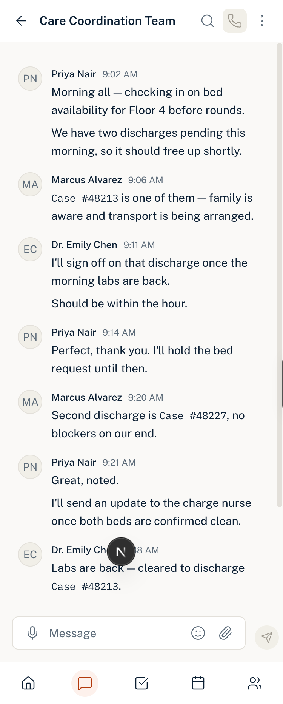

# 02: First result

`01-master-prompt.md` run once in Claude Code against the scaffolded Next.js project. Single pass, no follow-up instructions, no manual edits before capture.

## What it produced

A working chat screen at `/chat` with the three-pane structure intact: left rail, chat list, conversation. Nine conversations in the list and a ten message thread, seeded with a hospital care coordination scenario it invented.

It reported meeting all ten acceptance criteria from section 11.

## Verified before critique

Checked in devtools on the running build:

- Public Sans resolves on the thread. A font variable mismatch was found and fixed in a separate commit, since it sat outside the chat screen scope.
- Sender name computes to 13px at #0B1F33, matching the type scale and the navy token.
- Every text colour on screen came from the token list in section 6.
- Nothing in `components/ui` was modified.
- Message log container measures 617px wide with 16px 0px padding.

## Screenshots

Captured before any changes were made.

Critique of this output is in `03-critique.md`.
