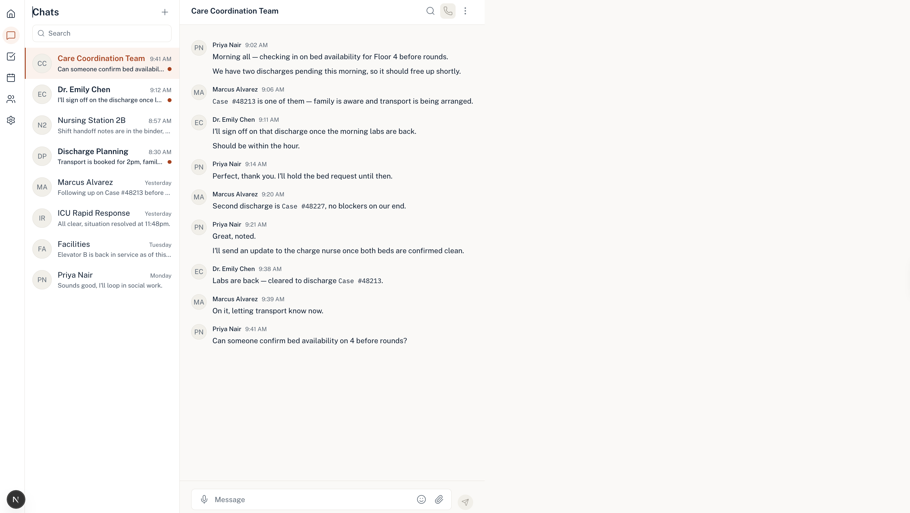
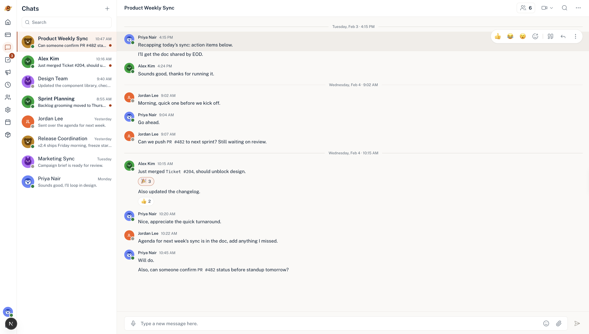
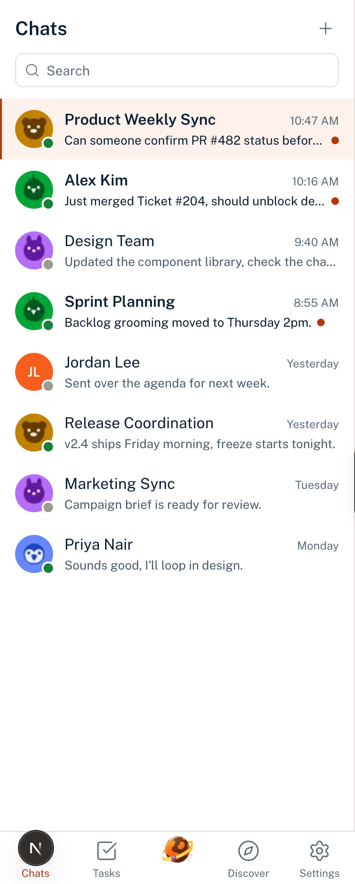
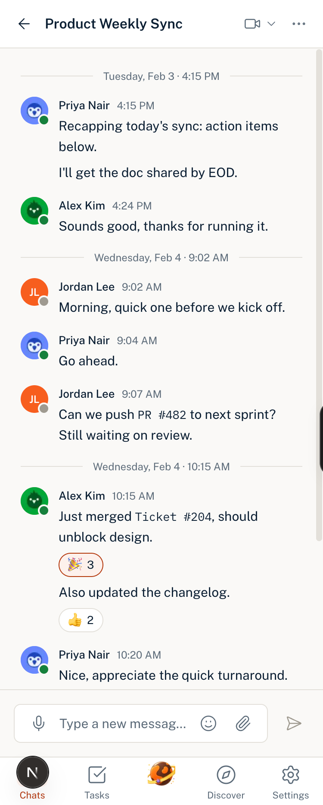

# 05: Final result

Output after running `04-revision-prompt.md` against the first build. Screenshots below are the same screen at the same viewport widths as `02-first-result.md`, so the two are directly comparable.

## Screenshots

Before, first result:

After, final:

## Verification against the critique

| Finding | Status |
|---|---|
| A2 Conversation pane capped at 617px | Fixed. Pane fills the viewport at every width above 1024px |
| A3 Rail active state had no container | Fixed. Active icon sits on a tinted container |
| A4 Send button wrong | Fixed, then corrected again. See note below |
| A5 Unread preview did not darken | Fixed. Weight, preview colour, and dot all present |
| A6 Mock data count off | Fixed. Eight conversations, twelve messages, with consecutive messages from one sender so grouping is testable |
| A7 Placeholder changed | Fixed |
| B1 Avatars were initials | Fixed. Five animal marks render from exported SVGs, with presence dots. The initials variant remains for users with no mark assigned, which is correct, it is part of the system |
| B2 Rail contents incomplete | Fixed. Ten icons, logomark, task badge, sign-out |
| B3 No date dividers | Fixed |
| B4 No reactions | Fixed. Pill renders in both its default and reacted states |
| B5 Selected title recoloured to clay | Fixed. Title stays navy, selection carried by tint and left bar |
| B6 Header actions incomplete | Fixed. Member pill, video with dropdown, search, overflow |
| B7 Seed content off-product | Fixed. Replaced with internal team content |

A1, the unsupportable self-grade, is addressed differently. The revision prompt asked for each criterion to be answered with a file and line reference rather than a yes, and for anything unverifiable without running the app to be named as such. That is the fix, since the problem was never the build, it was that the original criteria could be satisfied by assertion.

## What surfaced during the revision

Three things came up that the critique had not caught.

**The send button was specified wrong in the master prompt.** Section 6 called for a 32px clay circle with a white icon. Reading the Figma export, the design has no container at all, just a bare horizontal paper plane at the same size as the emoji and attach icons. This is another case of the prompt describing something the design never had, which is the same failure mode as B1 and B2, found one layer deeper.

**Hover and open states had drifted apart.** The video control was using the accent treatment on hover, which section 7 reserves for active and selected. Corrected so hover is neutral everywhere and accent marks only active, selected, and open. The focus ring was also rendering blue, a shadcn default that had survived the token swap, so criterion 9 had been failing quietly in the first build and neither the model nor my critique caught it from screenshots.

**The mobile header could not hold every desktop action.** At 375px the conversation name truncated to three characters while four controls and a member pill took the width. Resolved by keeping back, title, video, and overflow visible, and moving member count and search into the overflow menu. Video stayed because the users are hospital staff who need to start a call from a phone, and burying that behind a menu costs a tap at the moment it matters most.

## Known limitations

- The message hover toolbar exists in the build but is not reachable by keyboard, so its actions are mouse-only.
- The `/states` route renders the nine component states for verification. It is not part of the product and is not linked from the app.
- Team Tasks, the settings modal, and the remaining Orbit screens are designed in Figma and present in the interactive prototype, but are not implemented in this repo. The prompt package targets one screen, as the brief specified.

## What the loop was worth

The first build followed the prompt more faithfully than it followed the design, and that gap is the useful output of this exercise. Nine of the thirteen findings traced to my specification rather than the model, and every one of them was a case of naming an element and assuming the name carried the design. Avatar, six icons, header actions, send button.

The sections that produced accurate output on the first pass were the ones written as values. The sections that drifted were the ones written as prose.
